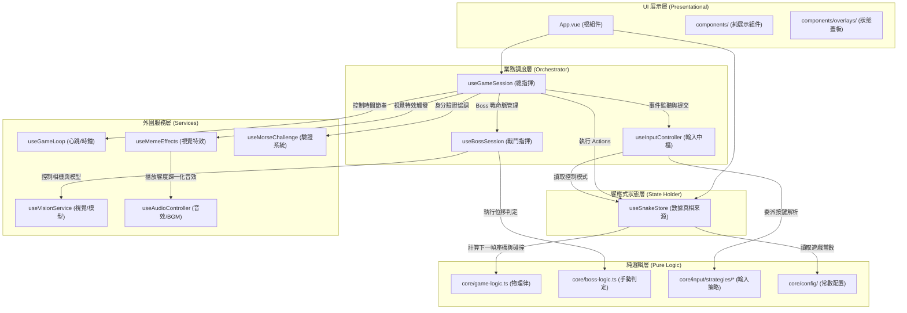
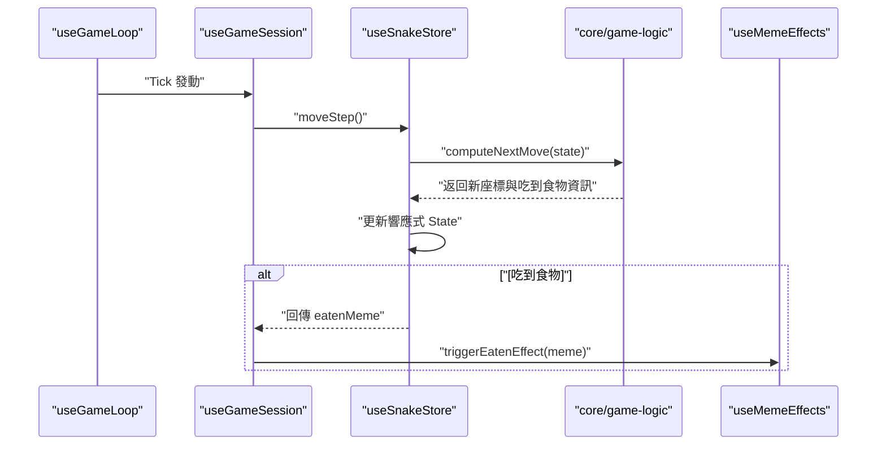
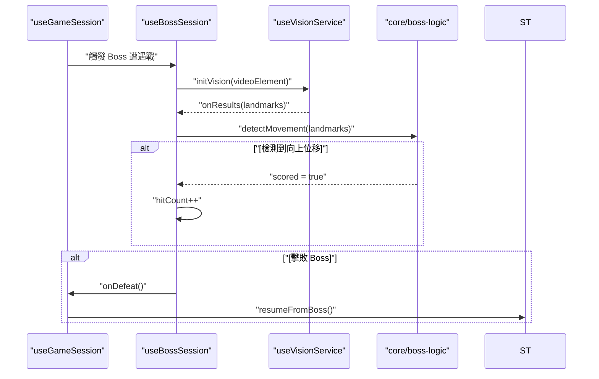

# 專案架構與職責定義 (Project Structure & Responsibilities)

本文件詳述 Brainrot Greedy Snake 的模組化架構。專案嚴格遵循「職責分離 (SoC)」與「純邏輯優先 (Pure Logic First)」原則。

---

## 1. 核心架構圖 (System Architecture)

---

## 2. 目錄與檔案職責詳解 (Directory & File Responsibilities)

### 📂 `src/core/` — 純邏輯與定義層
**原則：無任何 Vue 依賴，不持有狀態。程式碼可在 Node.js 環境中直接測試。**
- `types.ts`: 全域領域模型定義（Point, GameState, Direction 等）。
- `game-logic.ts`: 核心演算。包含 `computeNextMove`（計算下一幀）、`wrapPosition`（地圖鏡像循環）、`generateFood`（隨機食物）。
- `boss-logic.ts`: Boss 戰鬥判定。包含 `detectAlternatingMovement`（動態最低點位移算法）。
- `config/`: 
    - `game.ts`: 遊戲參數（速度、體積、Boss 觸發閾值）。
    - `meme-pool.ts`: 根據 `TOTAL_MEME_TYPES` 自動生成的迷因資源清單。
    - `controls/`: 各模式的按鍵映射配置。
- `input/`:
    - `strategies/`: 具體策略實作（Classic, Single Morse, Twin Morse），將按鍵行為封裝在工廠函式與閉包中。

### 📂 `src/composables/` — 響應式與服務層
**原則：封裝 Vue 的 `ref/computed` 以及副作用操作。**
- `useSnakeStore.ts`: **唯一的真相來源 (Module Singleton)**。提供 `moveStep`, `startGame`, `pauseGame` 等 Actions。
- `useGameSession.ts`: **最高階協調器**。監聽 `useGameLoop` 的 Tick，決定何時吃食物、何時結束、何時進 Boss 戰。
- `useInputController.ts`: 橋接 `window` 鍵盤事件至 `InputStrategy`，並提供 UI 用的 `uiDisplay` 提示。
- `useAudioController.ts`: 單例音訊引擎。包含 `AudioContext` 初始化、BGM 控制、以及音效響度歸一化 (Normalization)。
- `useVisionService.ts`: 封裝 Mediapipe 模型與攝影機的生命週期管理。
- `useMorseChallenge.ts`: 抽離 IDLE 狀態下的隨機摩斯密碼生成與比對邏輯。
- `useMemeEffects.ts`: 專門處理吃到食物後的 `lastEatenMeme` 狀態與音效觸發。

### 📂 `src/components/` — UI 展示層
**原則：純展示組件。不處理業務邏輯，僅透過 Props 接收數據並 Emit 事件。**
- `GameGrid.vue`: 渲染網格。使用 `GRID_SIZE` 動態生成 CSS Grid。
- `ScoreBoard.vue`: 顯示分數與目前狀態。
- `NavigationSidebar.vue`: 動態顯示目前的控制按鍵提示。
- `overlays/`: 
    - `IdleOverlay.vue`: 顯示開局挑戰與模式切換。
    - `BossBattleOverlay.vue`: 渲染 Boss 戰背景影片與 **Canvas 骨架圖**。
    - `MemeFlashOverlay.vue`: 處理全螢幕迷因閃爍特效。

---

## 3. 核心業務流程 (Core Workflows)

### 3-1. 遊戲單步移動 (Game Tick)

### 3-2. Boss 戰鬥判定流程

---

## 4. 開發守則 (Dev Rules)
1. **核心純粹性**：`src/core/` 禁止引入任何 Vue 的響應式 API。
2. **單向驅動**：時間與流程由 `Session` 驅動，`Store` 只負責保存狀態。
3. **組件隔離**：UI 組件不應直接存取 `useSnakeStore` 以外的 Composable，且應優先使用 Props。
